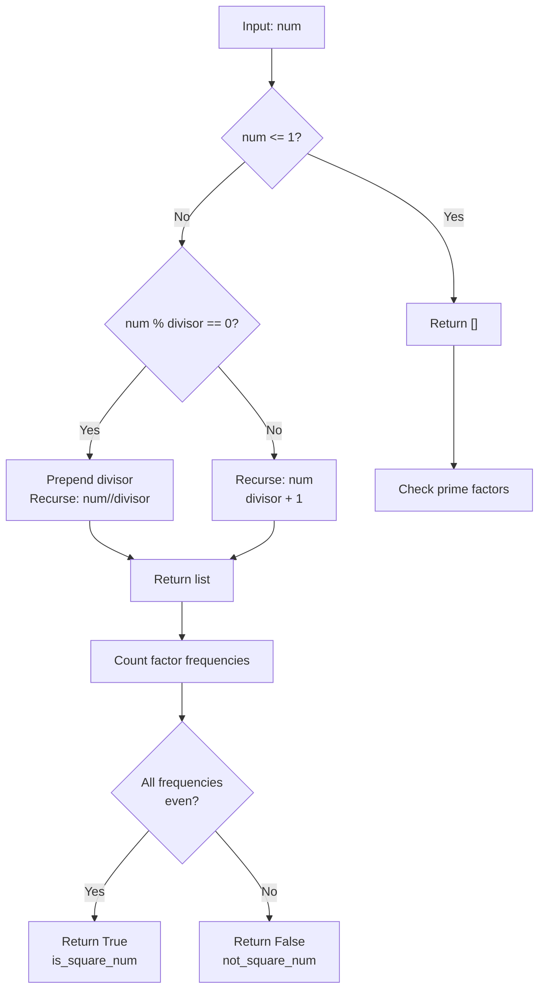
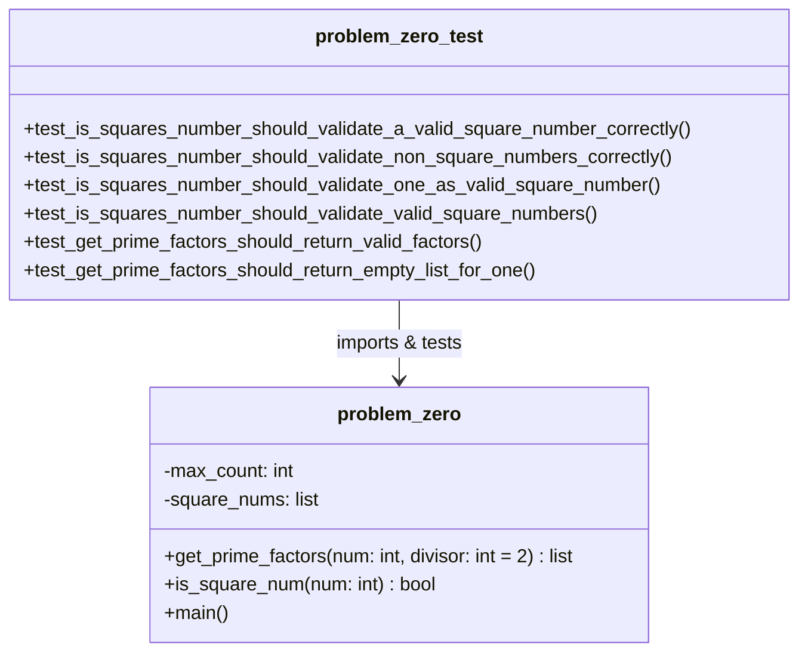

# Problem Zero 

## Code Implementation
* [problem_zero.py](../problems/problem_zero.py)
* [problem_zero_test.py](../tests/problem_zero/problem_zero_test.py)
    * [square_numbers.tx](../tests/problem_zero/square_numbers.txt)

## Architecture & Flow

### `is_square_number` Flow  

### Modules Architecture Class Diagram
