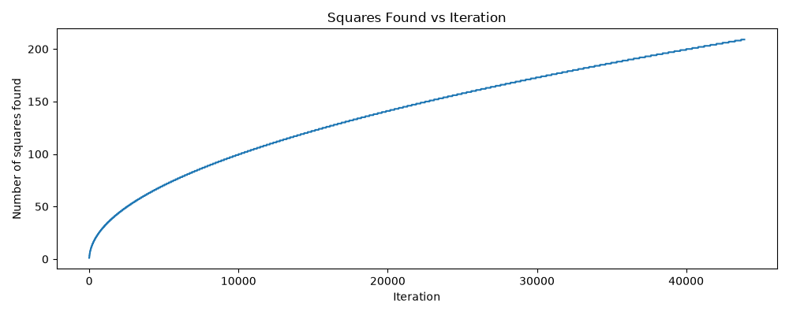

# Problem Zero 

## Code Implementation
* [problem_zero.py](../problems/problem_zero.py)
* [problem_zero_test.py](../tests/problem_zero/problem_zero_test.py)
    * [Test file (square_numbers.txt)](../tests/problem_zero/square_numbers.txt)
* [problem_zero_computation.json](problem_zero_computation.json)

## Asymptotic Analysis
The brute-force solution is inefficient because it checks each integer one by one and factors each number using trial division.
get_prime_factors(num) is 
𝑂
(
𝑛
𝑢
𝑚
)
O(num) worst case.
is_square_num(num) is also 
𝑂
(
𝑛
𝑢
𝑚
)
O(num) worst case because it factors the number and counts factor frequencies.
generate_k_square_nums(k) repeatedly calls is_square_num on increasing values of n, so if the largest checked value is 
𝑚
m, the total runtime is 
𝑂
(
𝑚
2
)
O(m
2
).
Since the first k square numbers are about 
1
2
,
2
2
,
…
,
𝑘
2
1
2
,2
2
,…,k
2
, the brute-force approach can be approximated as 
𝑂
(
𝑘
4
)
O(k
4
) overall.
problem_zero.py

 

 Although the number of matches grows like 
𝑂
(
𝑛
)
O(
n
), the algorithm still performs work on every integer it tests, so the runtime is driven by the full range of iterations rather than by the smaller number of squares found.
problem_zero.py
+1

## Conclusion
According to the computation [log](./problem_zero_computation.json), the algorithm took about `144` seconds to reach around `43904` iterations and had found `209` square numbers at that point, which illustrates how costly the brute-force approach becomes as the search range grows.
